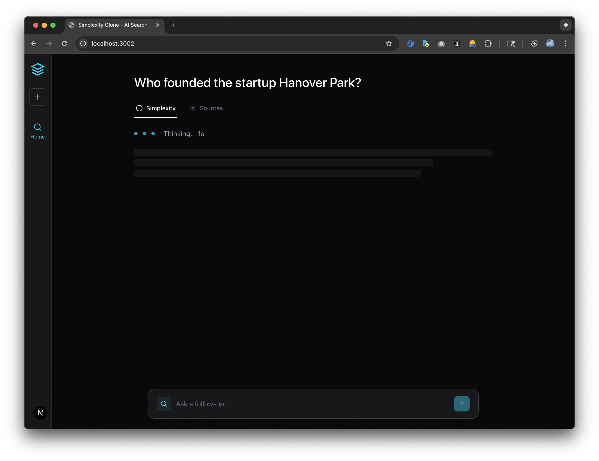
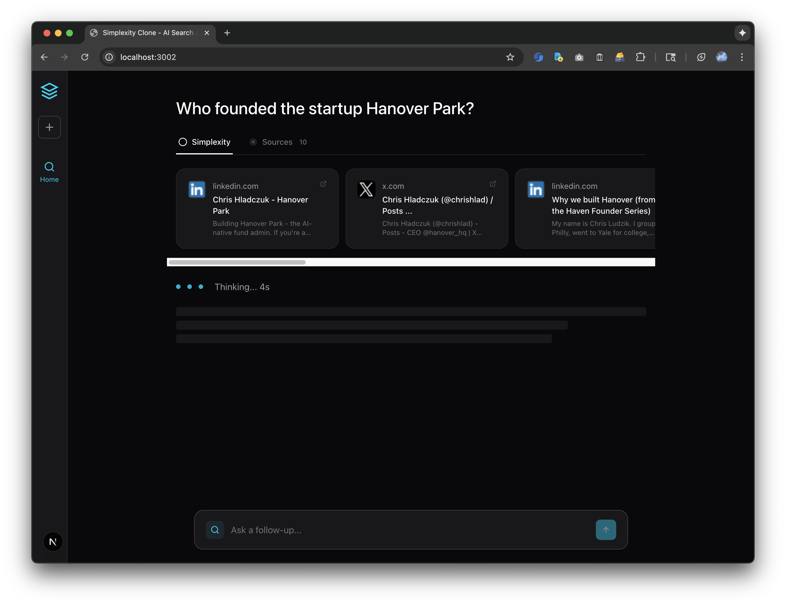
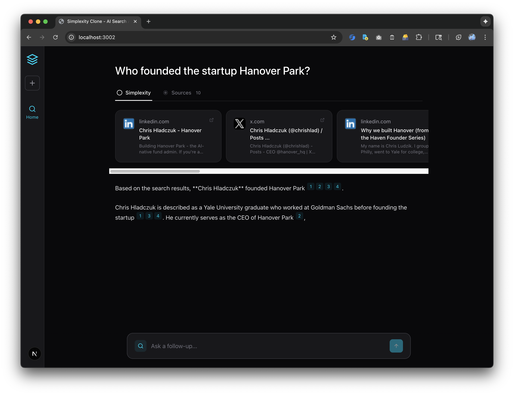
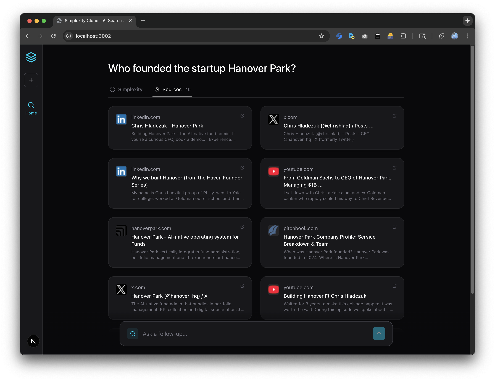
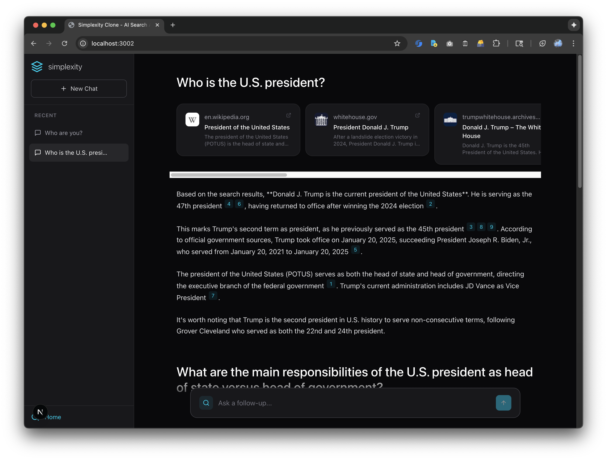
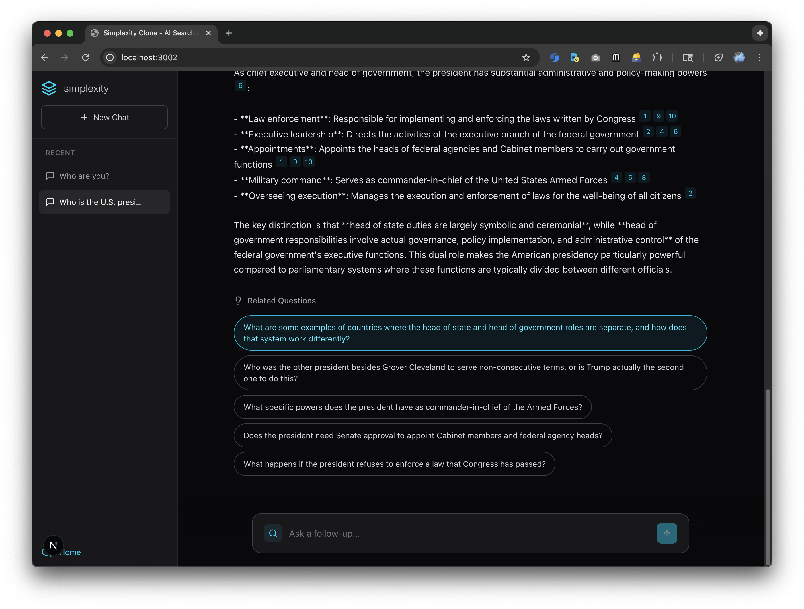
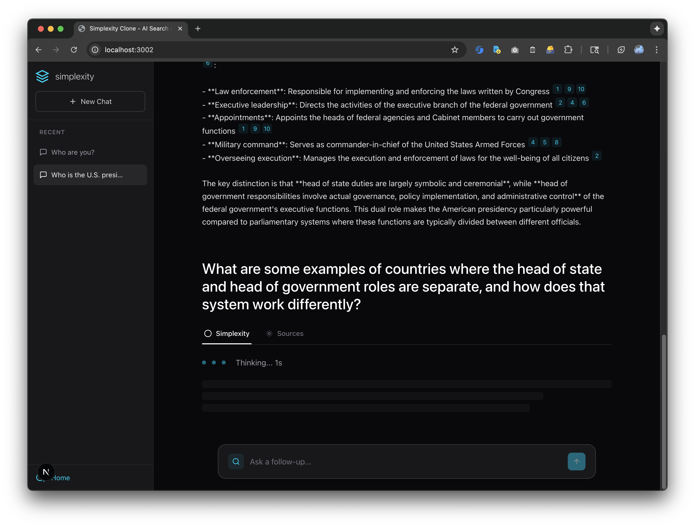

# Simplexity

A Perplexity.ai clone built with Next.js, TypeScript, and Claude AI.

**Live Demo:** [https://hanover-takehome.vercel.app/](https://hanover-takehome.vercel.app/)

## Features

- Real-time web search via SerpAPI (Google results)
- AI-powered answers using Claude Sonnet 4.5
- Inline citations with clickable source badges
- Progressive streaming (search results cascade in, answers appear word-by-word)
- Multi-turn conversations with persistent history
- Auto-generated conversation titles
- AI-generated suggested follow-up questions
- Tab navigation between answer view and sources grid
- sessionStorage persistence (survives page refresh)

## Next Features to Delight Users

- **Browser Extension** - Research portfolio companies without leaving Bloomberg/PitchBook. Highlight a ticker or company name → instant analysis with sources. Due diligence in seconds, not hours.

- **Share Conversations** - Send research links to investment committee members. Everyone sees the same sources and reasoning. No more forwarding 10 different PDFs or re-explaining your findings in meetings.

- **Citation Preview on Hover** - Verify regulatory claims and market data instantly. Hover over [1] to see the SEC filing or analyst report snippet. Critical for compliance and audit trails.

- **Export to Notion/Google Docs** - Drop research directly into investment memos and board reports. Fund admins spend hours reformatting research - one click eliminates that entirely.

- **Analyze This URL** - Paste a 10-K filing or industry report, get instant summary. Cuts hours of reading into 2 minutes of AI-powered analysis. Perfect for quick prep before partner calls.

- **Saved Searches & Alerts** - Monitor keywords like "regulatory changes" or specific portfolio companies. Get daily digests of relevant updates. Stay ahead of market moves without manual checking.

- **Keyboard Shortcuts** - `Cmd+K` for new research, `Cmd+Enter` to submit, `/` to focus search. Analysts running 20+ searches per day save hours per week.

- **Team Workspaces** - Shared conversation history across the fund. Junior analysts see what senior partners researched. Institutional knowledge becomes searchable, not siloed in email.

## Tech Stack

- **Next.js 15.2.4** - App Router, React Server Components, API Routes
- **React 19** - Concurrent rendering
- **TypeScript 5** - Full type safety
- **Tailwind CSS 4.1.9** - Styling
- **Anthropic Claude Sonnet 4.5** - AI answer generation
- **SerpAPI** - Google search results
- **ReadableStream** - Progressive UI updates

## Screenshots

### 1. Initial State


Clean interface with single search input.

---

### 2. Streaming Search Results


Search results appear one-by-one with cascading effect.

---

### 3. Multiple Sources


Multiple sources cascade in with favicon, title, and snippet.

---

### 4. AI Answer Streaming


Answer appears word-by-word as Claude generates it, with inline citations.

---

### 5. Sources Tab


2-column grid view of all sources.

---

### 6. Conversation History


Sidebar shows all past conversations with auto-generated titles and delete option.

---

### 7. AI-Generated Suggested Questions


Claude generates 3-5 contextual follow-up questions after each answer.

---

### 8. One-Click Exploration


Click a suggested question to instantly explore further.

---

## Getting Started

### Prerequisites

- Node.js 20.17.0 or higher
- [Anthropic API key](https://console.anthropic.com/)
- [SerpAPI key](https://serpapi.com/) (250 free searches/month)

### Installation

```bash
# Clone repository
git clone https://github.com/[username]/hanover-takehome.git
cd hanover-takehome/apps/frontend

# Install dependencies
npm install

# Create environment file
cp .env.example .env

# Add your API keys to .env
# ANTHROPIC_API_KEY=your_key_here
# SERPAPI_API_KEY=your_key_here

# Run development server
npm run dev
```

Visit [http://localhost:3000](http://localhost:3000)

### Deployment

```bash
# Deploy to Vercel
vercel
```

Set environment variables in Vercel dashboard:
- `ANTHROPIC_API_KEY`
- `SERPAPI_API_KEY`

## Project Structure

```
apps/frontend/
├── app/
│   ├── page.tsx                    # Main UI - conversation threading, streaming
│   ├── components/
│   │   ├── Sidebar.tsx            # Conversation history
│   │   ├── SearchInput.tsx        # Auto-resize textarea
│   │   ├── SourceCard.tsx         # Reusable source display
│   │   ├── TabNavigation.tsx      # Tab switching
│   │   ├── AnswerDisplay.tsx      # Markdown answer with citations
│   │   └── SuggestedQuestions.tsx # AI follow-up questions
│   └── api/
│       ├── search/route.ts        # SerpAPI streaming
│       ├── generate/route.ts      # Claude streaming
│       └── suggest-questions/route.ts
├── lib/
│   ├── types.ts                   # TypeScript interfaces
│   └── conversationStore.ts       # sessionStorage CRUD
└── package.json
```

## How It Works

### Streaming Architecture

**Search Results:**
```typescript
// Server sends results one-by-one with 100ms delay
for (let i = 0; i < results.length; i++) {
  const chunk = JSON.stringify({ type: 'result', data: results[i] }) + '\n';
  controller.enqueue(encoder.encode(chunk));
  await new Promise(resolve => setTimeout(resolve, 100));
}
```

**AI Answers:**
```typescript
// Stream Claude's response immediately
const messageStream = await anthropic.messages.create({
  model: 'claude-sonnet-4-5-20250929',
  stream: true,
  // ...
});

for await (const event of messageStream) {
  if (event.type === 'content_block_delta') {
    controller.enqueue(encoder.encode(
      JSON.stringify({ type: 'text', data: event.delta.text }) + '\n'
    ));
  }
}
```

**Client:**
```typescript
// Parse line-delimited JSON and update UI immediately
const reader = response.body?.getReader();
while (true) {
  const { done, value } = await reader.read();
  if (done) break;

  const lines = buffer.split('\n');
  for (const line of lines) {
    const message = JSON.parse(line);
    if (message.type === 'text') {
      fullAnswer += message.data;
      updateMessage(answerMessageId, { content: fullAnswer });
    }
  }
}
```

### Conversation Management

```typescript
// Auto-generate title from first query
if (!conversation.title && message.type === 'query') {
  conversation.title = message.content.slice(0, 60) +
    (message.content.length > 60 ? '...' : '');
}
```

### Suggested Questions

```typescript
// Generate questions in background after answer completes
const prompt = `Based on this conversation, suggest 3-5 natural follow-up questions.

Conversation history:
${conversationContext}

Current question: ${currentQuery}
Current answer: ${currentAnswer}

Generate questions that:
- Go deeper into interesting aspects mentioned
- Explore related angles not yet covered
- Are specific and actionable
- Feel natural as follow-ups

Return ONLY the questions, one per line.`;
```

## License

MIT License

---

**Built by Bryan Owens for Hanover Park**
