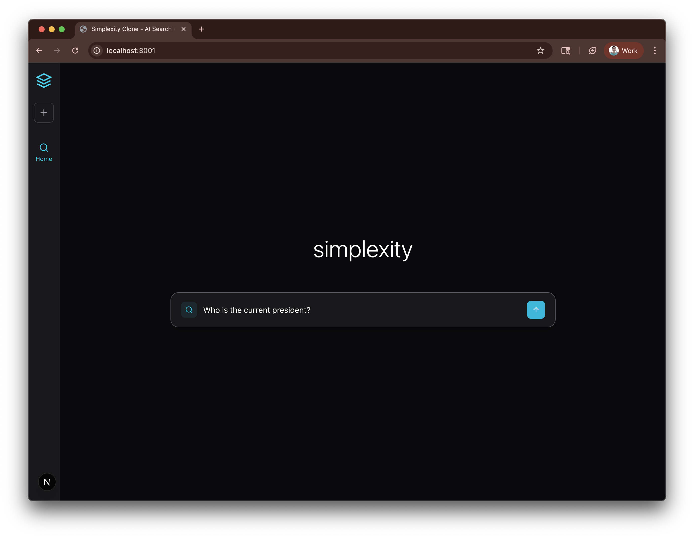
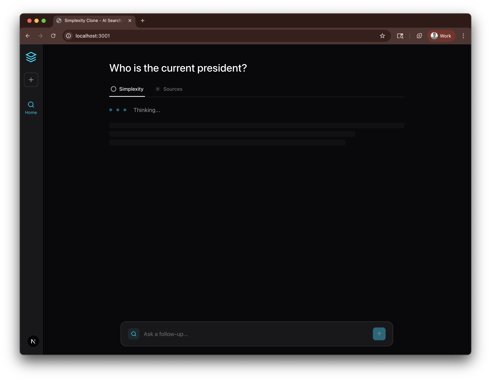
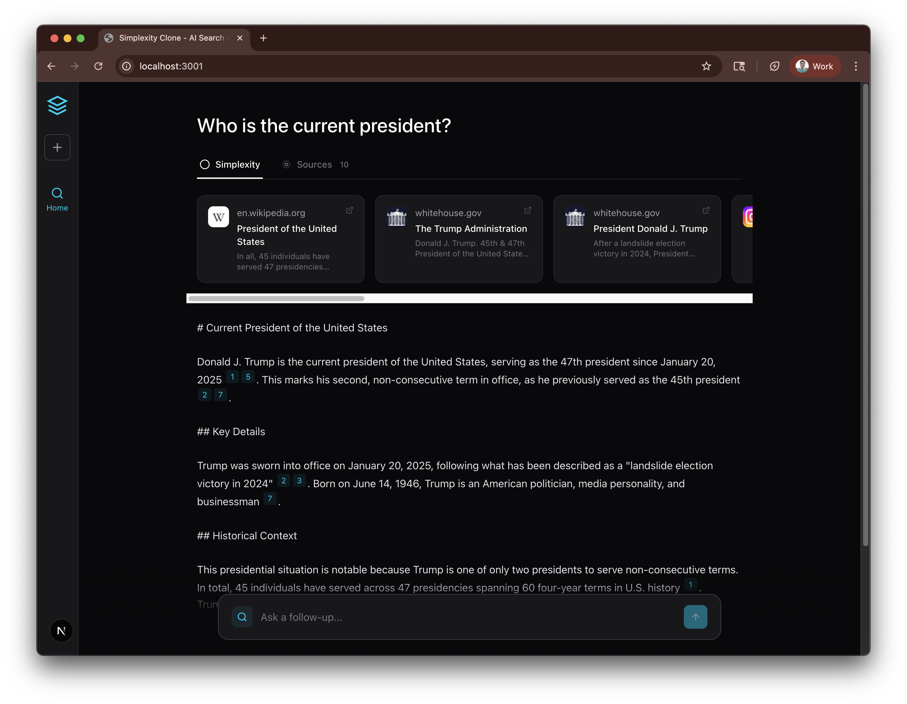
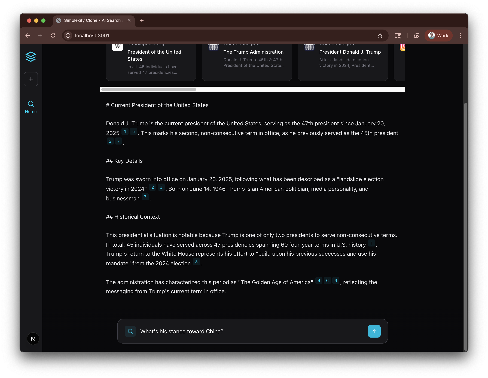
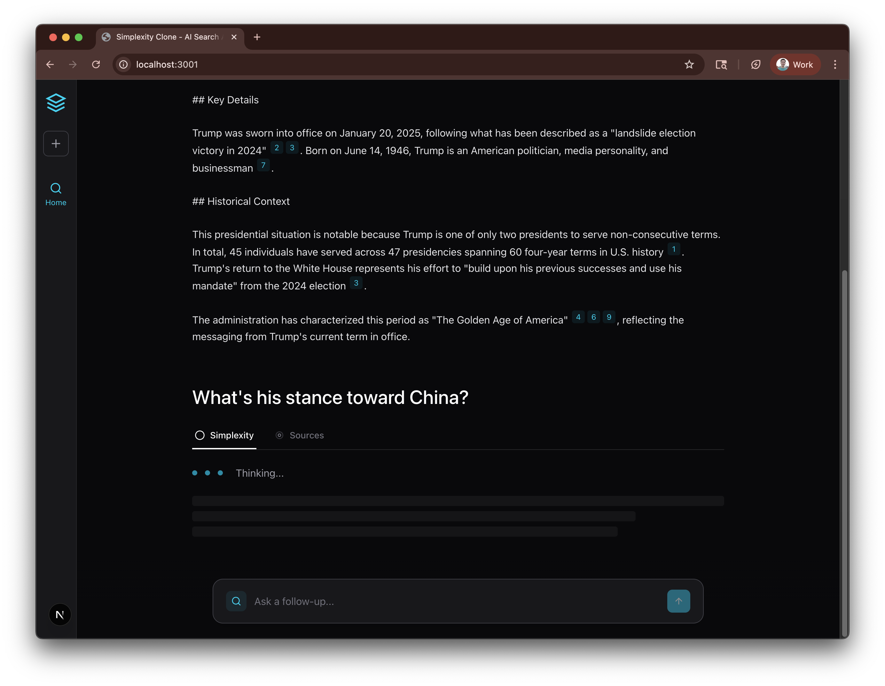
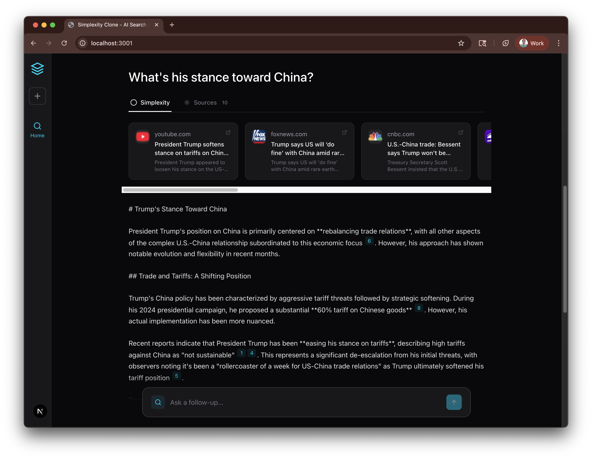

# Perplexity Clone - Hanover Park Take-Home

A simplified clone of Perplexity.ai built with TypeScript - allowing users to submit queries and receive AI-generated answers with citations based on real-time search results.

## Assignment Objectives

Build a web application that:
1. Accepts user search queries
2. Fetches real-time search results from search API
3. Generates AI-powered responses using search context
4. Displays results with proper citations and source links
5. (Bonus) Additional features as time permits

## Tech Stack

### Currently Installed
**Frontend Framework:**
- Next.js 15.2.4 (App Router, React Server Components)
- React 19
- TypeScript 5

**Styling & UI:**
- Tailwind CSS 4.1.9
- lucide-react (icons)
- clsx + tailwind-merge (utility functions)

**AI & APIs:**
- @anthropic-ai/sdk v0.67.0 (Anthropic Claude API)
- SerpAPI (web search results via HTTP API)

### Architecture
**State Management:**
- React hooks for local component state
- sessionStorage for conversation persistence (no external state library needed)

**Data Flow:**
- Client-side React components
- Next.js API routes for backend integration
- sessionStorage for conversation history

## Project Status

✅ **Status**: Core implementation complete

### Current Phase
- [x] Project setup and framework selection (Next.js + React + TypeScript + Tailwind)
- [x] API provider selection (SerpAPI + Anthropic Claude)
- [x] Core search + AI integration (API routes implemented)
- [x] UI implementation (Simplexity-style interface)
- [x] Citations and source linking
- [x] Conversation management (sessionStorage)
- [x] Testing and polish (conversation threading, auto-scroll, loading states)
- [x] Production deployment ready
- [ ] Additional features (optional enhancements)

## Architecture Decisions

### Framework & Core Tech (2025-10-20)
- **Next.js 15** with App Router for modern, performant architecture
- **React 19** for latest features and concurrent rendering
- **TypeScript 5** for type safety (required by assignment)
- **Tailwind CSS 4** for rapid, consistent styling
- **Next.js API Routes** for serverless backend endpoints
- **sessionStorage** for client-side conversation persistence

**Rationale**: Minimalist stack prioritizing speed and simplicity. Next.js API routes provide built-in backend without separate server. sessionStorage sufficient for MVP without database complexity. No state management library needed - React hooks handle UI state efficiently.

### Current Setup Status
- ✅ **Base Framework**: Next.js 15 + React 19 + TypeScript 5
- ✅ **Styling**: Tailwind CSS 4 with minimal configuration
- ✅ **Icons**: lucide-react
- ✅ **Build**: Successfully builds and runs (`npm run build` passes)
- ⏳ **Additional Dependencies**: To be added as needed based on implementation approach

### API Providers (Selected)

**Search API: SerpAPI**
- Provides Google search results via API
- Free tier: 100 searches/month
- Good documentation and TypeScript support
- Rationale: Mentioned in assignment description, reliable results

**LLM API: Anthropic Claude**
- Claude Sonnet 4.5 for high-quality responses
- Excellent at following citation instructions
- Strong context understanding for search results
- Rationale: Better citation accuracy than alternatives, good free tier

### Implementation Architecture

**Components:**
- `Sidebar` - Navigation and new chat functionality
- `SearchInput` - Query input with loading states
- `ConversationView` - Main conversation container
- `SourceCard` - Individual search result display
- `TabNavigation` - Perplexity/Sources/Steps tabs
- `AnswerDisplay` - AI response with inline citations

**API Routes:**
- `/api/search` - Fetches search results from SerpAPI
- `/api/generate` - Generates AI responses with Claude

**Data Management:**
- sessionStorage for conversation persistence
- No database required for MVP
- Conversation history maintained client-side

See `docs/AGENTS_APPENDLOG.md` for complete decision history and time tracking.

## Development

### Setup Instructions

```bash
# Navigate to frontend directory
cd apps/frontend

# Install dependencies (already done)
npm install

# Run development server
npm run dev
```

The app will be available at [http://localhost:3000](http://localhost:3000)

### Building for Production

```bash
npm run build
npm start
```

### Environment Variables

Copy `.env.example` to `.env.local` and add your API keys:

```bash
cp .env.example .env.local
```

Then add your API keys to `.env.local`:
- `ANTHROPIC_API_KEY` - Your Anthropic API key from https://console.anthropic.com/
- `SERPAPI_API_KEY` - Your SerpAPI key from https://serpapi.com/

**Required API Keys:**
1. **Anthropic API Key**: Sign up at https://console.anthropic.com/ (free tier available)
2. **SerpAPI Key**: Sign up at https://serpapi.com/ (100 free searches/month)

## Screenshots

### 1. Initial State


Clean interface with "simplexity" branding, centered search input ready for queries.

### 2. Loading State


Immediate feedback with pulsing dots and skeleton UI showing expected content structure.

### 3. First Answer with Sources & Citations


Comprehensive AI-generated answer with:
- Horizontal scrollable source cards (Wikipedia, whitehouse.gov)
- Inline citations as clickable cyan badges [1], [2], [7]
- Well-structured markdown formatting

### 4. User Typing Follow-Up Question


Fixed input at bottom allows typing follow-ups while reviewing previous answer. Previous content preserved (conversation threading).

### 5. Second Question Loading - Conversation Threading


**Key feature**: Previous Q&A remains visible above. New question displays with loading state. Auto-scroll positions new question at top of viewport.

### 6. Multi-Turn Conversation Complete


Second answer fully rendered with fresh sources and citations. Users can scroll up to review entire conversation history.

## Time Allocation

**Total Time Spent**: ~2 hours 45 minutes

### Breakdown by Phase:
1. **Planning & Design** (~15 min): Screenshot analysis, architecture planning, component design
2. **Core Implementation** (~45 min): Type definitions, API routes, state management, UI components
3. **Debugging & Fixes** (~20 min): File location issues, lucide-react resolution, env configuration
4. **API Migration** (~10 min): Switched from fetch to official serpapi client library
5. **UI Polish** (~5 min): Cursor pointer on buttons, button styling
6. **Branding** (~10 min): Complete Perplexity → Simplexity rename
7. **Conversation Threading** (~30 min): Multi-turn Q&A display, auto-scroll, fixed input, skeleton loading
8. **Model Upgrade & Testing** (~50 min): Claude Sonnet 4.5 upgrade, end-to-end testing, documentation

### What Would Be Improved With More Time

**UI/UX Enhancements:**
- Conversation history sidebar (list of past searches)
- Streaming responses (Claude SDK supports streaming, not implemented in MVP)
- Better loading states (skeleton screens, animated transitions)
- Mobile responsive design (currently desktop-focused)
- Keyboard shortcuts (Cmd+K to focus search, etc.)

**Features:**
- "Steps" tab implementation (show reasoning process)
- Related questions suggestions
- Image search results
- Dark/light theme toggle
- Export conversation as markdown

**Technical Improvements:**
- Error boundary components for graceful failure handling
- Retry logic for API failures
- Rate limiting UI (show remaining API calls)
- Unit tests for utility functions
- E2E tests with Playwright
- Caching layer for search results (avoid duplicate API calls)

**Code Quality:**
- tRPC for end-to-end type safety
- Separate API client libraries into dedicated modules
- More granular TypeScript types (less reliance on `any`)
- Storybook for component documentation
- Performance monitoring (Core Web Vitals)

## Documentation

This project maintains comprehensive documentation at multiple levels:

- **CLAUDE.md** - Instructions for AI agents working on this project (living document, updated with learnings)
- **docs/AGENTS.md** - Agent workflows and development patterns (evolves as methodology improves)
- **docs/AGENTS_APPENDLOG.md** - Complete decision and activity log (append-only, chronological narrative)

### Meta-Documentation Approach

This project uses a **conversation-driven development** methodology:
- Every significant change is logged in AGENTS_APPENDLOG.md with full context
- User prompts and agent responses are tracked to show decision evolution
- Insights are incorporated holistically into CLAUDE.md and AGENTS.md
- This creates a transparent narrative of the development process for the assignment writeup

**Documentation Workflow:**
1. Make a change → 2. Append to log → 3. Update summaries → 4. Incorporate insights → 5. Refine workflows

## License

MIT
